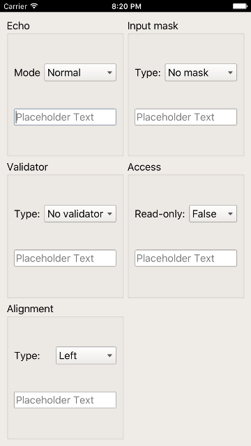

## Screenshots

### Windows


### macOS


### Linux


### Android

#### Portrait


#### Landscape


### iOS

#### Portrait


#### Landscape


### Sailfish OS


---
---

## Installation

**You will need at least 6gb ram to install this binding!**

* Desktop
	* [Windows](#windows-1)
	* [macOS](#macos-1)
	* [Linux](#linux-1)

* Mobile
	* [Android](#android-1)
	* [iOS](#ios-1)
	* [Sailfish OS](#sailfish-os-1)

* Embedded
	* [Raspberry Pi](#raspberry-pi)

---

## Windows

1. Install Go >= 1.7.1 and setup a proper [**GOPATH**](https://golang.org/doc/code.html#GOPATH)

	* https://golang.org/doc/install?download=go1.7.1.windows-amd64.msi

2. Install Qt 5.7.0 in `C:\Qt\Qt5.7.0\` or define the env variable `QT_INSTALL_DIR`

	* https://download.qt.io/official_releases/qt/5.7/5.7.0/qt-opensource-windows-x86-android-5.7.0.exe

3. Add the directory that contains **gcc.exe** and **g++.exe** to your **PATH**

	* `C:\Qt\Qt5.7.0\Tools\mingw530_32\bin\`

4. Download the binding

	* `go get -d github.com/therecipe/qt`

5. Generate, install and test (~20 min)

	* `cd %GOPATH%\src\github.com\therecipe\qt && setup.bat` **(run as admin)**

6. Create your first [application](#example)

## macOS

1. Install Go >= 1.7.1 and setup a proper [**GOPATH**](https://golang.org/doc/code.html#GOPATH)

	* https://golang.org/doc/install?download=go1.7.1.darwin-amd64.pkg

2. Prepare the go directory

	* `sudo chown -R $USER /usr/local/go/`

3. Prepare the Qt installation directory

	* `QT_INSTALL_DIR=/usr/local/Qt5.7.0/; sudo mkdir $QT_INSTALL_DIR && sudo chown $USER $QT_INSTALL_DIR`

4. Install Qt 5.7.0 in `/usr/local/Qt5.7.0/` or define the env variable `QT_INSTALL_DIR`

	* without iOS https://download.qt.io/official_releases/qt/5.7/5.7.0/qt-opensource-mac-x64-android-5.7.0.dmg
	* with iOS https://download.qt.io/official_releases/qt/5.7/5.7.0/qt-opensource-mac-x64-android-ios-5.7.0.dmg

5. Install **Xcode** >= 7.3.1

	* https://itunes.apple.com/us/app/xcode/id497799835

6. Download the binding

	* `go get -d github.com/therecipe/qt`

7. Generate, install and test (~20 min)

	* `cd $GOPATH/src/github.com/therecipe/qt && ./setup.sh`

8. Create your first [application](#example)

## Linux

1. Install Go >= 1.7.1 and setup a proper [**GOPATH**](https://golang.org/doc/code.html#GOPATH)

	* https://golang.org/doc/install?download=go1.7.1.linux-amd64.tar.gz

2. Prepare the go directory

	* `sudo chown -R $USER /usr/local/go/`

3. Prepare the Qt installation directory

	* `QT_INSTALL_DIR=/usr/local/Qt5.7.0/; sudo mkdir $QT_INSTALL_DIR && sudo chown $USER $QT_INSTALL_DIR`

4. Install Qt 5.7.0 in `/usr/local/Qt5.7.0/` or define the env variable `QT_INSTALL_DIR`

	* https://download.qt.io/official_releases/qt/5.7/5.7.0/qt-opensource-linux-x64-android-5.7.0.run

5. Install **g++** and **OpenGL** dependencies

	* `sudo apt-get -y install build-essential mesa-common-dev`

6. Download the binding

	* `go get -d github.com/therecipe/qt`

7. Generate, install and test (~20 min)

	* `cd $GOPATH/src/github.com/therecipe/qt && ./setup.sh`

8. Create your first [application](#example)

---

## Android

1. Install the desktop version

2. Install the Android SDK in `C:\android\android-sdk\` or `/opt/android-sdk/`
	* https://dl.google.com/android/android-sdk_r24.4.1-windows.zip
	* https://dl.google.com/android/android-sdk_r24.4.1-macosx.zip
	* https://dl.google.com/android/android-sdk_r24.4.1-linux.tgz

3. Install the SDK dependencies with `C:\android\android-sdk\tools\android.bat` or `/opt/android-sdk/tools/android`
	* Tools
		* Android SDK Build-tools (24.0.2)
	* Android 7.0 (API 24)
		* SDK Platform
	* Extras (Windows only)
		* Google USB Driver

4. Install the Android NDK in `C:\android\android-ndk\` or `/opt/android-ndk/`
	* https://dl.google.com/android/repository/android-ndk-r12b-windows-x86_64.zip
	* https://dl.google.com/android/repository/android-ndk-r12b-darwin-x86_64.zip
	* https://dl.google.com/android/repository/android-ndk-r12b-linux-x86_64.zip

5. Install Java SE Development Kit (Linux: install in `/opt/jdk/`)
	* https://www.oracle.com/technetwork/java/javase/downloads/jdk8-downloads-2133151.html

6. Install and test (~20 min)

	* `cd %GOPATH%\src\github.com\therecipe\qt && setup.bat android` **(run as admin)**

		or

	* `cd $GOPATH/src/github.com/therecipe/qt && ./setup.sh android`

7. Create your first [application](#example)

## iOS

1. Install the desktop version for [macOS](#macos-1)

2. Install and test (~20 min)

	* `cd $GOPATH/src/github.com/therecipe/qt && ./setup.sh ios && ./setup.sh ios-simulator`

3. Create your first [application](#example)

## Sailfish OS

1. Install the desktop version

2. Install VirtualBox
	* https://download.virtualbox.org/virtualbox/5.1.6/VirtualBox-5.1.6-110634-Win.exe
	* https://download.virtualbox.org/virtualbox/5.1.6/VirtualBox-5.1.6-110634-OSX.dmg
	* https://download.virtualbox.org/virtualbox/5.1.6/VirtualBox-5.1.6-110634-Linux_amd64.run

3. Install the Sailfish OS SDK in `C:\SailfishOS\` or `/opt/SailfishOS/`
	* https://releases.sailfishos.org/sdk/installers/1608/SailfishOSSDK-Beta-1608-Qt5-windows-offline.exe
	* https://releases.sailfishos.org/sdk/installers/1608/SailfishOSSDK-Beta-1608-Qt5-mac-offline.dmg
	* https://releases.sailfishos.org/sdk/installers/1608/SailfishOSSDK-Beta-1608-Qt5-linux-64-offline.run

4. Install and test (~20 min)

	* `cd %GOPATH%\src\github.com\therecipe\qt && setup.bat sailfish && setup.bat sailfish-emulator` **(run as admin)**

		or

	* `cd $GOPATH/src/github.com/therecipe/qt && ./setup.sh sailfish && ./setup.sh sailfish-emulator`

5. Create your first [application](#example)

---

## Raspberry Pi

1. Install the desktop version for [Linux](#linux-1)

2. Create a folder `[HOME]/raspi`

	* `mkdir ~/raspi`

3. Download and unpack the Qt 5.7.0 source

	* `cd ~/raspi && wget https://download.qt.io/official_releases/qt/5.7/5.7.0/single/qt-everywhere-opensource-src-5.7.0.tar.gz`
	* `tar -xzf qt-everywhere-opensource-src-5.7.0.tar.gz qt-everywhere-opensource-src-5.7.0`

4. Patch Qt Source

	* `cd ~/raspi/qt-everywhere-opensource-src-5.7.0/qtbase && sed -i 's/c++1z/c++11/' ./mkspecs/devices/linux-rpi3-g++/qmake.conf`

	* `cd ~/raspi/qt-everywhere-opensource-src-5.7.0/qtwayland && wget https://github.com/qtproject/qtwayland/commit/75294be3.patch && patch -p1 -i 75294be3.patch`

5. Download the cross compiler

	* `cd ~/raspi && git clone --depth 1 https://github.com/raspberrypi/tools.git`

6. Get dependencies and install Arch Linux on your SD card

	* `sudo apt-get -y install bsdtar libwayland-dev flex bison gperf python`

	* Raspberry Pi 1
		* https://archlinuxarm.org/platforms/armv6/raspberry-pi

	* Raspberry Pi 2
		* https://archlinuxarm.org/platforms/armv7/broadcom/raspberry-pi-2

	* Raspberry Pi 3
		* https://archlinuxarm.org/platforms/armv8/broadcom/raspberry-pi-3

7. Start your Raspberry Pi

8. Enable root login over ssh

	* `export RASPI_IP=192.168.XXX.XXX` (replace XXX.XXX with the valid ip ending)

	* `ssh alarm@$RASPI_IP` (password: alarm)

	* `su` (password: root)

	* `sed -i 's/#PermitRootLogin/PermitRootLogin/' /etc/ssh/sshd_config && sed -i 's/prohibit-password/yes/' /etc/ssh/sshd_config && systemctl restart sshd.service`

9. Update and install dependencies (~5 min)

	* `pacman -Syyu`

	* `pacman -S fontconfig icu libinput libjpeg-turbo libproxy libsm libxi libxkbcommon-x11 libxrender tslib xcb-util-image xcb-util-keysyms xcb-util-wm freetds gtk3 libfbclient libmariadbclient mtdev postgresql-libs unixodbc assimp bluez-libs sdl2 jasper libmng libwebp gst-plugins-base-libs libpulse openal gst-plugins-bad hunspell libxcomposite wayland gst-plugins-base libxslt gst-plugins-good ffmpeg jsoncpp libevent libsrtp libvpx libxcursor libxrandr libxss libxtst nss opus protobuf snappy xcb-util xcb-util-cursor xcb-util-renderutil xcb-util-xrm libxfixes libxshmfence libxext libx11 libxcb libice weston ttf-freefont lxde gamin xorg-server xorg-xinit xorg-server-utils mesa xf86-video-fbdev xf86-video-vesa xorg-server-xwayland xf86-input-libinput gst-plugins-ugly sqlite2 cups xorg-server-devel rsync`

	* `pacman -Scc`

	* Raspberry Pi 1
		* `sed -i 's/gpu_mem=64/gpu_mem=128/' /boot/config.txt`
		* `echo "exec startlxde" >> ~/.xinitrc && mkdir ~/.config/ && echo -e "[core]\nbackend=fbdev-backend.so\nmodules=xwayland.so" >> ~/.config/weston.ini`
		* `echo "dtoverlay=vc4-kms-v3d,cma-128" >> /boot/config.txt && sed -i 's/fbdev-backend/drm-backend/' ~/.config/weston.ini` (**experimental**: enable OpenGL under X; will break most applications)

	* Raspberry Pi 2 or 3
		* `sed -i 's/gpu_mem=64/gpu_mem=256/' /boot/config.txt`
		* `echo "exec startlxde" >> ~/.xinitrc && mkdir ~/.config/ && echo -e "[core]\nbackend=fbdev-backend.so\nmodules=xwayland.so" >> ~/.config/weston.ini`
		* `echo "dtoverlay=vc4-kms-v3d,cma-256" >> /boot/config.txt && sed -i 's/fbdev-backend/drm-backend/' ~/.config/weston.ini` (**experimental**: enable OpenGL under X; will break most applications)

	* `reboot`

10. Get sysroot for cross compiling (password: root) (~5 min)

	* `cd ~/raspi && mkdir sysroot sysroot/usr sysroot/opt`

	* `rsync -avz root@$RASPI_IP:/lib sysroot --delete`

	* `rsync -avz root@$RASPI_IP:/usr/include sysroot/usr --delete`

	* `rsync -avz root@$RASPI_IP:/usr/lib sysroot/usr --delete`

	* `rsync -avz root@$RASPI_IP:/opt/vc sysroot/opt --delete`

11. Fix sysroot

	* `cd ~/raspi && wget https://raw.githubusercontent.com/riscv/riscv-poky/master/scripts/sysroot-relativelinks.py`
	* `chmod +x sysroot-relativelinks.py && ./sysroot-relativelinks.py sysroot`

12. Build Qt (~2 h)

	* `cd ~/raspi/qt-everywhere-opensource-src-5.7.0`

	* Raspberry Pi 1
		* `./configure -opengl es2 -device linux-rasp-pi-g++ -device-option CROSS_COMPILE=~/raspi/tools/arm-bcm2708/arm-rpi-4.9.3-linux-gnueabihf/bin/arm-linux-gnueabihf- -sysroot ~/raspi/sysroot -opensource -confirm-license -make libs -skip webengine -nomake tools -nomake examples -extprefix /usr/local/Qt5.7.0/5.7/rpi1 -I ~/raspi/sysroot/opt/vc/include -I ~/raspi/sysroot/opt/vc/include/interface/vcos -I ~/raspi/sysroot/opt/vc/include/interface/vcos/pthreads -I ~/raspi/sysroot/opt/vc/include/interface/vmcs_host/linux -silent`

	* Raspberry Pi 2
		* `./configure -opengl es2 -device linux-rasp-pi2-g++ -device-option CROSS_COMPILE=~/raspi/tools/arm-bcm2708/arm-rpi-4.9.3-linux-gnueabihf/bin/arm-linux-gnueabihf- -sysroot ~/raspi/sysroot -opensource -confirm-license -make libs -skip webengine -nomake tools -nomake examples -extprefix /usr/local/Qt5.7.0/5.7/rpi2 -I ~/raspi/sysroot/opt/vc/include -I ~/raspi/sysroot/opt/vc/include/interface/vcos -I ~/raspi/sysroot/opt/vc/include/interface/vcos/pthreads -I ~/raspi/sysroot/opt/vc/include/interface/vmcs_host/linux -silent`

	* Raspberry Pi 3
		* `./configure -opengl es2 -device linux-rpi3-g++ -device-option CROSS_COMPILE=~/raspi/tools/arm-bcm2708/arm-rpi-4.9.3-linux-gnueabihf/bin/arm-linux-gnueabihf- -sysroot ~/raspi/sysroot -opensource -confirm-license -make libs -skip webengine -nomake tools -nomake examples -extprefix /usr/local/Qt5.7.0/5.7/rpi3 -I ~/raspi/sysroot/opt/vc/include -I ~/raspi/sysroot/opt/vc/include/interface/vcos -I ~/raspi/sysroot/opt/vc/include/interface/vcos/pthreads -I ~/raspi/sysroot/opt/vc/include/interface/vmcs_host/linux -silent`

	* `make -k -i && sudo make -k -i install`

13. Prepare the Qt directory

	* `sudo chown -R $USER /usr/local/Qt5.7.0/`

14. Install and test the binding (~20 min)

	* Raspberry Pi 1
		* `cd $GOPATH/src/github.com/therecipe/qt && ./setup.sh rpi1`

	* Raspberry Pi 2
		* `cd $GOPATH/src/github.com/therecipe/qt && ./setup.sh rpi2`

	* Raspberry Pi 3
		* `cd $GOPATH/src/github.com/therecipe/qt && ./setup.sh rpi3`

15. Notes

	* run `startx &` before starting an application with `-platform xcb` (qml/quick applications won't work; they may work with Qt 5.8)

	* run `weston &` or `weston --tty=1 &` (via ssh) or create your own [compositor](https://doc.qt.io/qt-5/qtwaylandcompositor-index.html) before starting an application with `-platform wayland-egl` (qml/quick applications won't work; they may work with Qt 5.8)

	* you can increase the available gpu memory by editing `/boot/config.txt`

16. Create your first [application](#example)

---
---

## Example

1. Create a project folder `[GOPATH]/src/qtExample`

2. Create a file `[GOPATH]/src/qtExample/main.go`
	```go
package main

import (
		"os"

		"github.com/therecipe/qt/core"
		"github.com/therecipe/qt/widgets"
)

func main() {
		widgets.NewQApplication(len(os.Args), os.Args)

		//create a button and connect the clicked signal
		var button = widgets.NewQPushButton2("Click me!", nil)
		button.ConnectClicked(func(flag bool) {
			widgets.QMessageBox_Information(nil, "OK", "You clicked me!", widgets.QMessageBox__Ok, widgets.QMessageBox__Ok)
		})

		//create a layout and add the button
		var layout = widgets.NewQVBoxLayout()
		layout.AddWidget(button, 0, core.Qt__AlignCenter)

		//create a window, add the layout and show the window
		var window = widgets.NewQMainWindow(nil, 0)
		window.SetWindowTitle("Hello World Example")
		window.SetMinimumSize2(200, 200)
		window.Layout().DestroyQObject()
		window.SetLayout(layout)
		window.Show()

		widgets.QApplication_Exec()
}
```

3. Open the { command-line | terminal | shell } in `[GOPATH]/src/qtExample` and run `qtdeploy build desktop`

4. You will find the application in `[GOPATH]/src/qtExample/deploy/[GOOS]/qtExample`

5. Take a look at the [examples](https://github.com/therecipe/qt/tree/master/internal/examples)

6. Make yourself familiar with the [Qt documentation](https://doc.qt.io/qt-5/classes.html)
