macOS
-----

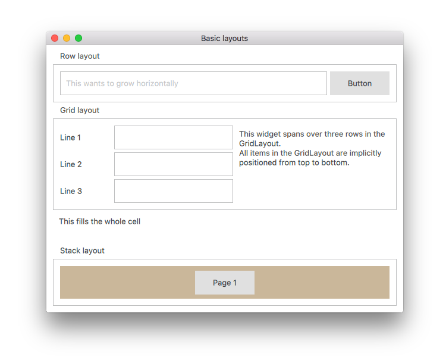

[source](internal/examples/qml/application)

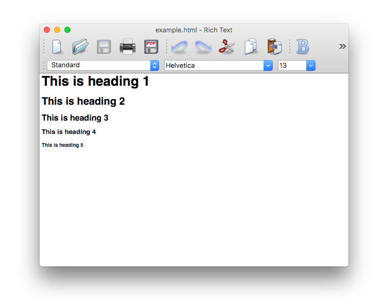

[source](internal/examples/widgets/textedit)

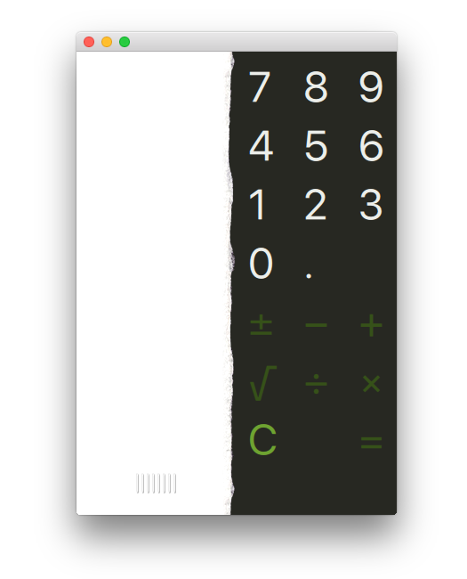

[source](internal/examples/quick/calc)

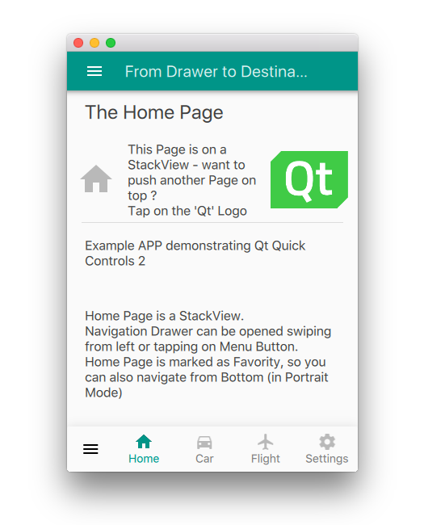

[source](internal/examples/qml/drawer_nav_x)

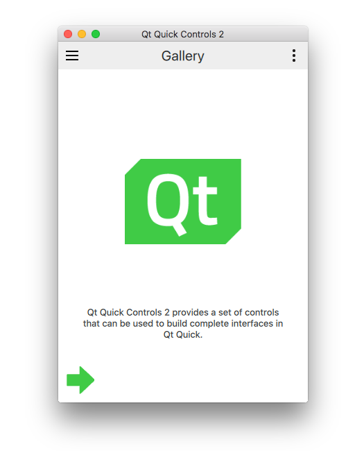

[source](internal/examples/qml/gallery)

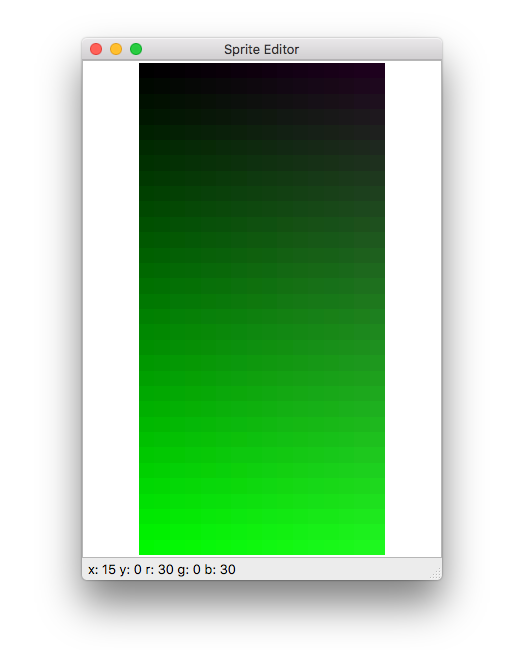

[source](internal/examples/widgets/pixel_editor)

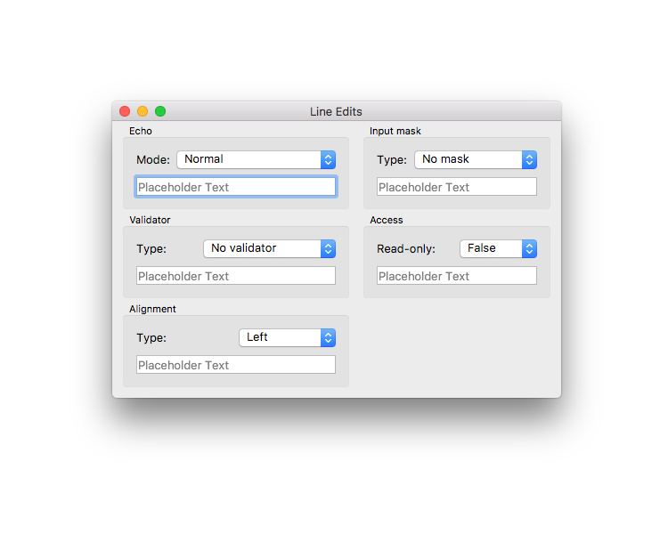

[source](internal/examples/widgets/line_edits)

Windows
-------

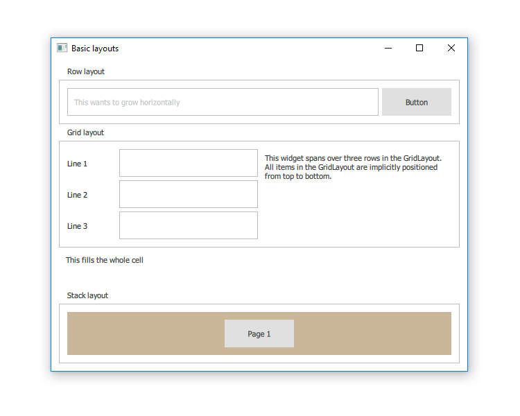

[source](internal/examples/qml/application)

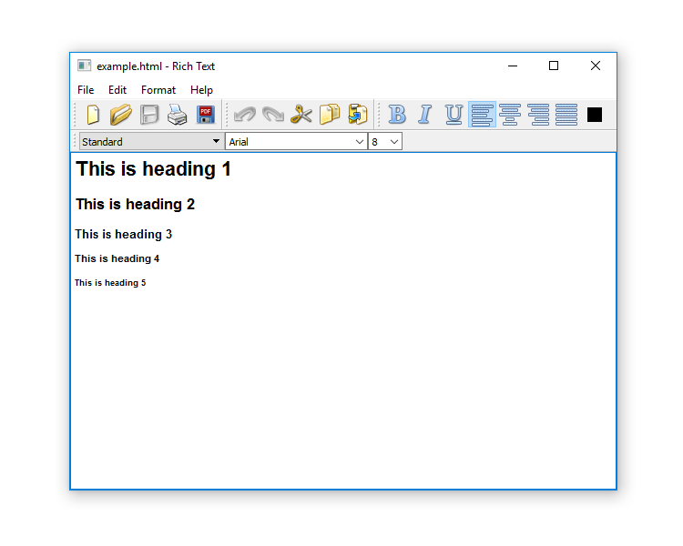

[source](internal/examples/widgets/textedit)

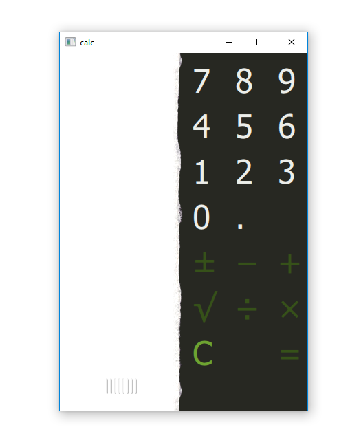

[source](internal/examples/quick/calc)

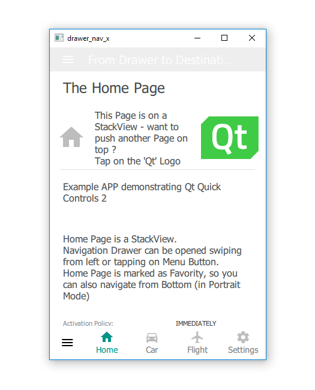

[source](internal/examples/qml/drawer_nav_x)

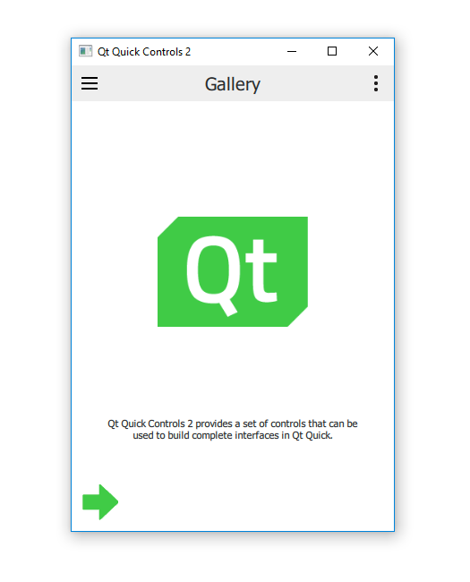

[source](internal/examples/qml/gallery)

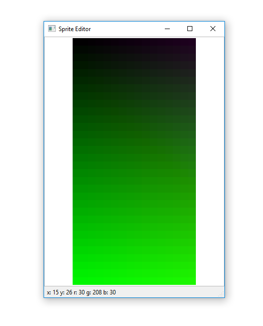

[source](internal/examples/widgets/pixel_editor)

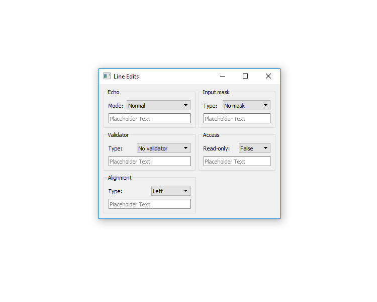

[source](internal/examples/widgets/line_edits)

Linux
-----

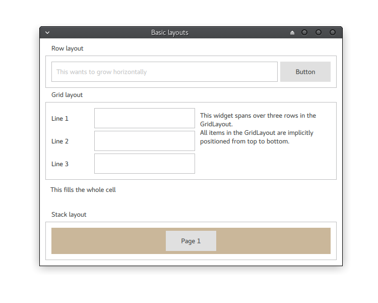

[source](internal/examples/qml/application)

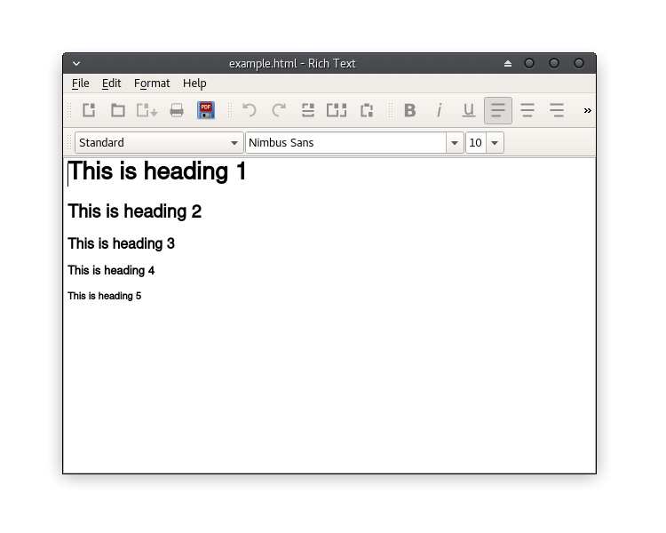

[source](internal/examples/widgets/textedit)

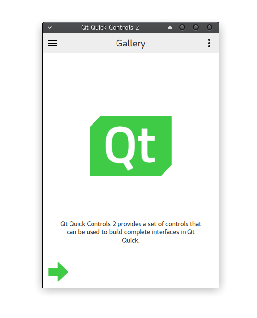

[source](internal/examples/quick/calc)

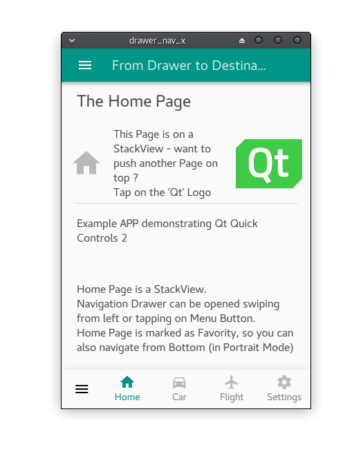

[source](internal/examples/qml/drawer_nav_x)

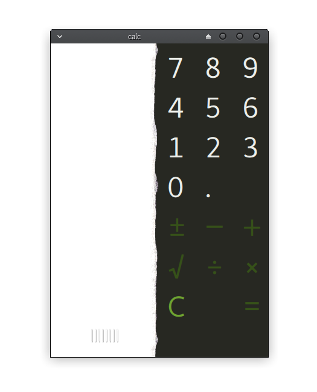

[source](internal/examples/qml/gallery)

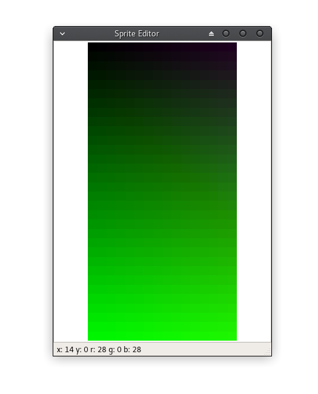

[source](internal/examples/widgets/pixel_editor)

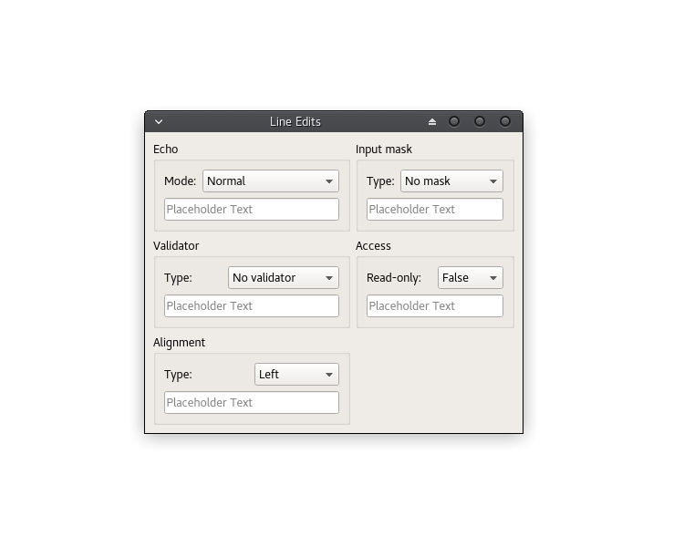

[source](internal/examples/widgets/line_edits)

Android
-------

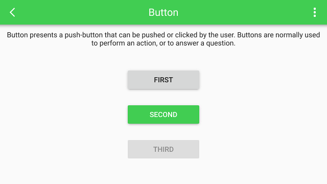

[source](internal/examples/qml/gallery)

iOS
---

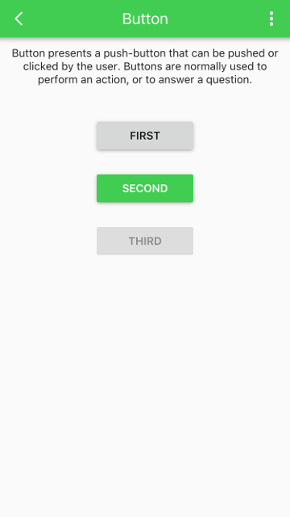

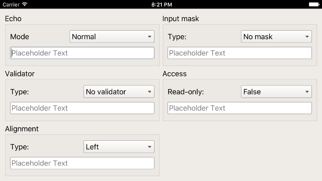

[source](internal/examples/qml/gallery)

SailfishOS
----------

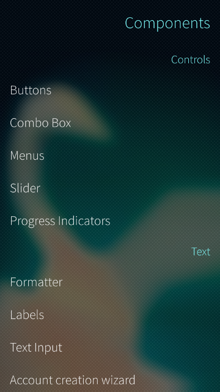

[source](internal/examples/quick/sailfish)
